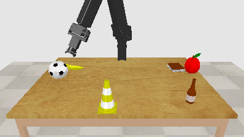

# Compositional Generalization in Multimodal Language Learning



This repository shares the most important sources used for the reasearch paper "More Diverse Training, Better Compositionality! Evidence from Multimodal Language Learning" by Caspar Volquardsen, Jae Hee Lee, Cornelius Weber, and Stefan Wermter. This paper was accepted to the International Conference on Artificial Neural Networks 2022 (ICANN 2022) in Bristol for an oral presentation and published in the [proceedings](https://doi.org/10.1007/978-3-031-15934-3_35 "DOI").

This repository also includes the sources used to generate the Multimodal-Robot-Simulation dataset. This is implemented for [CoppeliaSim](https://www.coppeliarobotics.com "CoppeliaSim") educational version using [PyRep](https://github.com/stepjam/PyRep "PyRep GitHub"). The sources were originally provided by Aaron Eisermann and adapted by Caspar Volquardsen.

The original dataset downloaded for the experiments in the paper [1] can be accessed by members of the University of Hamburg (UHH) with the following [link](https://unihamburgde-my.sharepoint.com/:u:/g/personal/caspar_volquardsen_studium_uni-hamburg_de/EQiwFjBtBv9ClUW_429NZp0Byw79Pto7hFXSRJkXqlF_Pg?e=qgMWag "OneDrive"). If you are not from the UHH you can contact [me](caspar.volquardsen@uni-hamburg.de "caspar.volquardsen@uni-hamburg.de") via e-mail to get access.  

## How to use
This project uses [Weights and Biases](https://wandb.ai "Weights and Biases") to log the results of the experiments. This means, if you want to use the code you need to have w&b installed and change project_name and user_name in line 330 in train.py to your personal w&b details:
```python
with wandb.init(project="project_name", entity="user_name", config=config, name=run_name):
```

It is recommended to create a virtual environment for this project. It was tested with python 3.9 (>=3.6 is nessesary due to the use of f-strings). To install the nessesary requirements run:
```
pip3 install -r pathto/requirements.txt
```

To see all possible commandline arguments run:
```
python3 train.py -h
```


## References
[1] Volquardsen, C., Lee, J.H., Weber, C., Wermter, S. (2022). More Diverse Training, Better Compositionality! Evidence from Multimodal Language    Learning. In: Pimenidis, E., Angelov, P., Jayne, C., Papaleonidas, A., Aydin, M. (eds) Artificial Neural Networks and Machine Learning – ICANN 2022. ICANN 2022. Lecture Notes in Computer Science, vol 13531. Springer, Cham. https://doi.org/10.1007/978-3-031-15934-3_35
